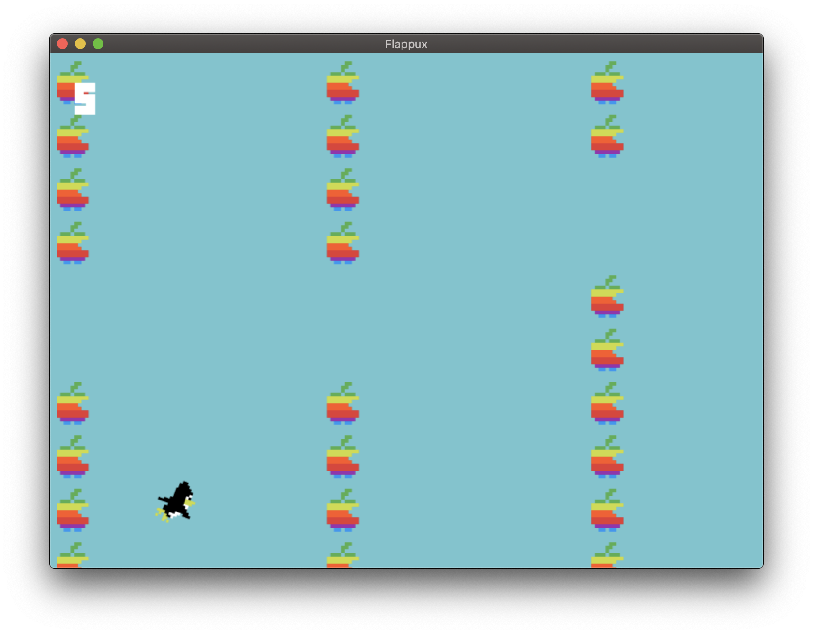

# Flappux
<!-- ALL-CONTRIBUTORS-BADGE:START - Do not remove or modify this section -->
[](#contributors-)
<!-- ALL-CONTRIBUTORS-BADGE:END -->
Challenge the two sides playing Flappy Bird! Written in HTML and JS, powered by Electron.

</img>

## The goal
The goal is to reproduce a different concept of the original Flappy bird game which challenges the two sides: Linux and "Others".

## Building
The main aim is to have a desktop app for macOS, Windows and Linux for easier gameplay and access. Though, if you want to play the game from your browser, it's possible to do so. Below you can find the two main methods to build and play the game.

### 1. As a desktop app
The desktop apps (macOS, Windows, Linux) are powered by Electron. Electron renders the already existing HTML and JavaScript code to a reponsive and ready desktop app.

1. Clone/download the repository
The first step in building the game is to clone or download the repository. If you already have git installed on your computer, you can clone the repository with:

```
git clone https://github.com/ardacebi/flappux
```

If you don't have git installed or don't want it, you can download the repository as a .zip file from the green download button at the very above.

2. Download necessary dependencies and packages
Because of Electron, the game uses the npm package manager. If you don't have it on your computer, you need it. You can get it from [here](https://www.npmjs.com/get-npm). Before you build and start the game, you need to download and install the necessary packages and dependencies with:

```
npm install
```

3. Build
After the steps above, you're ready to build and play the game. Just build and start the game with:

```
npm start
```

### 2. As a web app/site
The second method is to run the game in your browser, without installing a separate app using Electron.

1. Clone/download the repository
If you already have git installed on your computer, you can clone the repository with:

```
git clone https://github.com/ardacebi/flappux
```

If you don't have git installed or don't want it, you can download the repository as a .zip file from the green download button at the very above.

2. Locate index.html
After cloning or download the repository, navigate to the downloaded folder and locate the index.html file and double click on it. This will launch the game on your browser.

## Contributing
All contributions are welcome. To-do's and known bugs are logged as issues in this repository. You can contribute with your changes by creating a fork of the repository and opening a pull request.

## Contributors

Thanks goes to these wonderful people ([emoji key](https://allcontributors.org/docs/en/emoji-key)):

<!-- ALL-CONTRIBUTORS-LIST:START - Do not remove or modify this section -->
<!-- prettier-ignore-start -->
<!-- markdownlint-disable -->
<table>
  <tr>
    <td align="center"><a href="https://www.ardacebi.com"><br /><sub><b>Arda Çebi</b></sub></a><br /><a href="https://github.com/ardacebi/flappux/commits?author=ardacebi" title="Code">💻</a> <a href="https://github.com/ardacebi/flappux/commits?author=ardacebi" title="Documentation">📖</a></td>
    <td align="center"><a href="http://mercode.org"><br /><sub><b>Tan Siret G. AKINCI</b></sub></a><br /><a href="https://github.com/ardacebi/flappux/commits?author=Yutyo" title="Code">💻</a> <a href="#design-Yutyo" title="Design">🎨</a></td>
  </tr>
</table>

<!-- markdownlint-enable -->
<!-- prettier-ignore-end -->
<!-- ALL-CONTRIBUTORS-LIST:END -->
